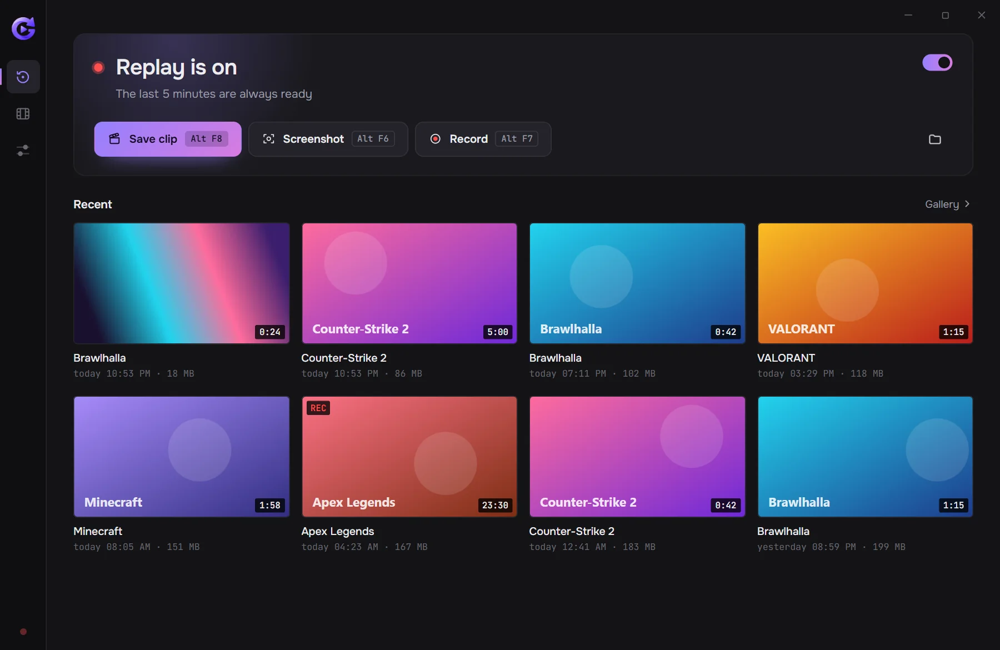
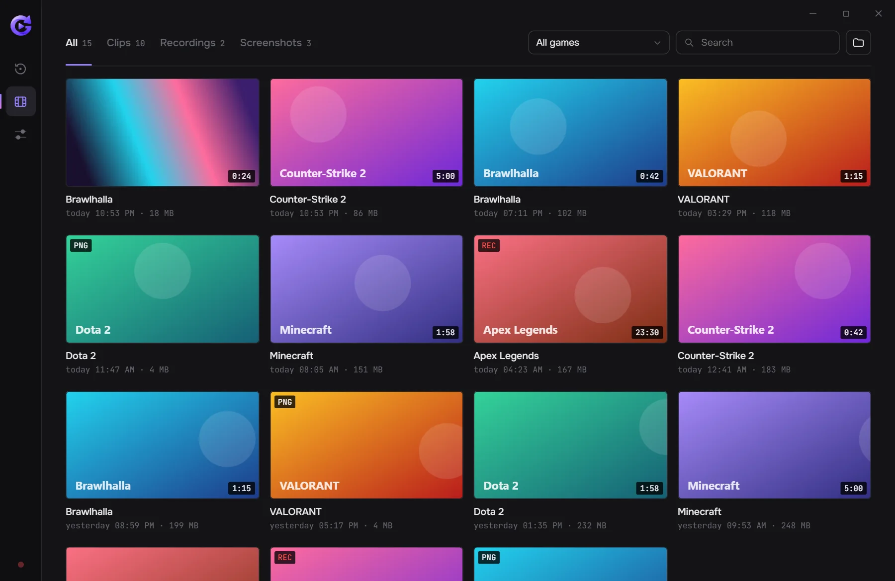

<p align="center">
  
</p>

<h1 align="center">GeniusClip</h1>

<p align="center">
  Instant replay for Windows. GeniusClip keeps the last minutes of your game in memory<br>
  and saves them as a clip when you press a hotkey — on NVIDIA, AMD and Intel graphics alike.
</p>

<p align="center">
  <a href="https://github.com/GandalfDark/geniusclip-releases/releases/latest"></a>
  
  <a href="LICENSE"></a>
</p>

<p align="center">
  <a href="https://github.com/GandalfDark/geniusclip-releases/releases/latest/download/GeniusClip-Setup.exe"><b>Download</b></a> ·
  <a href="https://gandalfdark.github.io">Website</a> ·
  <a href="https://github.com/GandalfDark/geniusclip-releases/releases">Changelog</a> ·
  <a href="https://github.com/GandalfDark/geniusclip/issues">Issues</a>
</p>

<br>

<p align="center">
  
</p>

## Features

- **Replay buffer** of up to 60 minutes, in memory or on disk; a clip is one hotkey away.
  Short clips, screenshots and regular recordings too.
- **Hardware encoding** with NVENC (NVIDIA), AMF (AMD) and Media Foundation (Intel);
  H.264, HEVC and AV1. An unchanged screen is encoded only a few times per second
  (variable frame rate), with a constant-frame-rate option for video editors.
- **Audio** from the game and the microphone on separate tracks, with microphone noise
  suppression ([DeepFilterNet 3](https://github.com/Rikorose/DeepFilterNet)).
- **Gallery** sorted by game, with favorites and a trim editor with per-track volume.
- **Only in games** (optional): capture pauses while no game is on the recorded monitor,
  so the PC isn't loaded outside games.
- **In-game menu** (<kbd>Alt</kbd> + <kbd>X</kbd>) with recent clips, a player and quick
  settings. It is a separate always-on-top window: nothing is injected into games, so it
  is safe with anti-cheat systems.
- **14 interface languages**, automatic updates, no account and no telemetry.

<table>
  <tr>
    <td width="50%"></td>
    <td width="50%"></td>
  </tr>
</table>

## Download

Get **[GeniusClip-Setup.exe](https://github.com/GandalfDark/geniusclip-releases/releases/latest/download/GeniusClip-Setup.exe)**
from the [releases repository](https://github.com/GandalfDark/geniusclip-releases), which
also has install instructions and the changelog. Windows 10 or 11, 64-bit, with graphics
that can encode video (NVIDIA, AMD or Intel).

## How it works

- `crates/engine` — the Rust engine: screen capture (DXGI Desktop Duplication)
  → BGRA→NV12 on the GPU (D3D11 video processor) → hardware encoding (FFmpeg)
  → ring buffer → MP4 without re-encoding. Audio: WASAPI (system + microphone)
  → AAC, up to 3 tracks.
- `src-tauri` — the Tauri 2 app: tray, hotkeys, settings, autostart, updates,
  overlay notifications, in-game menu.
- `src` — the interface (SvelteKit, Svelte 5).
- `crates/setup` — the branded installer window around the NSIS setup.
- `site` — the website, [gandalfdark.github.io](https://gandalfdark.github.io).

## Building

Needs Rust (MSVC toolchain), Node.js, Visual Studio Build Tools and LLVM (libclang
for bindgen).

```powershell
# once: download the FFmpeg build made by the "Build FFmpeg" workflow
./scripts/fetch-ffmpeg.ps1
npm install
npm run tauri dev
```

Test the engine without the interface (8-second replay into a folder):

```powershell
cargo run -p geniusclip-engine --example replay -- 8 target/replay-test
```

## Contributing

Bug reports and ideas are welcome in [issues](https://github.com/GandalfDark/geniusclip/issues).
If something breaks, *Settings → Report a problem* in the app makes a zip with the log
(your user and computer names are taken out) that you can attach. For code changes, open an issue first
so we can agree on the approach.

## Code signing policy

Releases are not code-signed yet. We plan to sign them for free through
[SignPath.io](https://about.signpath.io) with a certificate by the
[SignPath Foundation](https://signpath.org). Signed releases will be built by GitHub
Actions from this repository ([`release.yml`](.github/workflows/release.yml)); only
binaries built from this repository will be signed.

- Committers and reviewers: [GandalfDark](https://github.com/GandalfDark)
- Approvers: [GandalfDark](https://github.com/GandalfDark)

## Privacy policy

GeniusClip does not collect or send any personal data, usage statistics or
recordings. Clips and screenshots stay on your computer and leave it only when
you share them yourself.

The program connects to the internet only to:

- check for updates: it downloads
  `https://github.com/GandalfDark/geniusclip-releases/releases/latest/download/latest.json`
  every few hours and, when you choose to install an update, the new installer
  (turn the check off in *Settings → Update automatically*);
- the installer may download Microsoft's WebView2 runtime if Windows lacks it.

The interface itself can't load anything from the internet (it is locked to
local content by its Content Security Policy).

## License

GeniusClip is free software under the [GNU General Public License v3.0 or
later](LICENSE).

Third-party components: [FFmpeg](https://ffmpeg.org) (LGPL 2.1+, a minimal
build made from source by [`ffmpeg.yml`](.github/workflows/ffmpeg.yml), used as
DLLs), [DeepFilterNet](https://github.com/Rikorose/DeepFilterNet) (MIT /
Apache-2.0), [Tauri](https://tauri.app), [Svelte](https://svelte.dev),
[tract](https://github.com/sonos/tract) and the crates listed in `Cargo.lock`.
